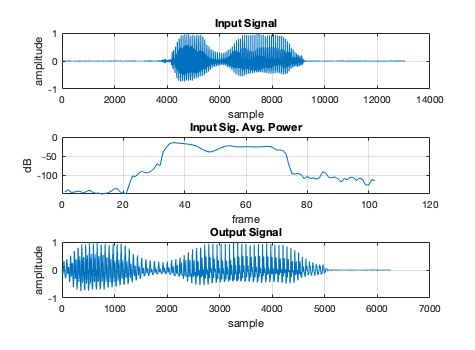
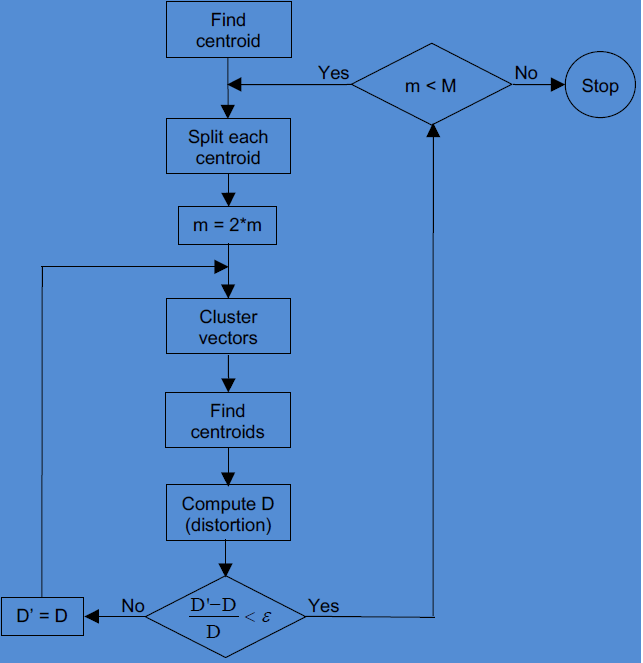
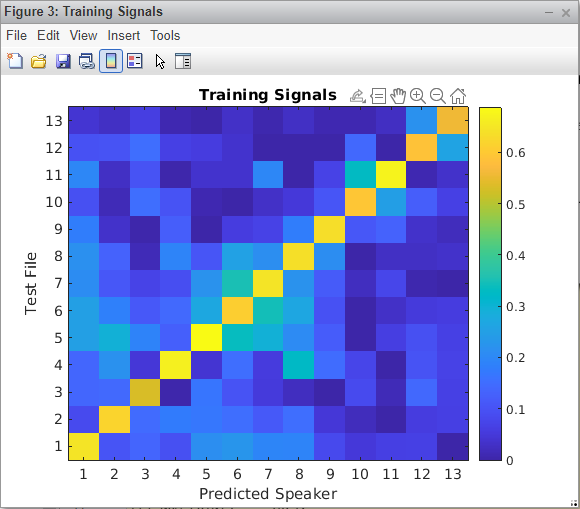
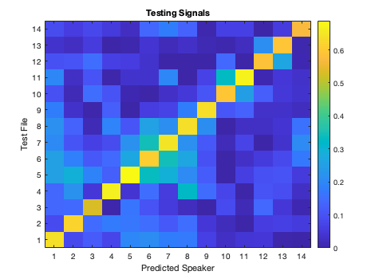

  

# EEC-201 Final Project : Team Omega
Authors: Igor Sheremet and Jonathan Tivald

Date: March 2021

# Project Overview

In this project, we implement a speaker recognition program that learns a set of speakers and then identifies if a test speaker is one of the learned speakers. The recognition process can be broken down into two main parts: speech feature extraction and speech feature matching.

Before extracting the speech features, the speech signal is pre-processed to clean up undesired characteristics such as DC offsets and signal amplitude variations between different speakers. Next, the region that contains the word is detected and extracted from the speech signal. The speech features are then extracted from the pre-processed signals using Mel-Frequency Cepstral Coefficients (MFCC) [1].

For the feature matching part, this project implements what is known as the Linde Buzo Gray (LBG) Vector Quantization (VQ) method [2], which falls under the general umbrella of k-clustering, to learn and recognize human speech. The algorithm may read in training data (*.wav audio files) to generate "codebooks" (combination of "codewords") which characterize each training files MFCC. The Algorithm may then read in test data generated from the same speaker to identify which speaker the test data belongs to based on the learned "codebook."

# Speech Feature Extraction

## Signal Pre-Processing

The input data sets have some undesired characteristics that we want to 'clean up' before we attempt to extract speech features from them. After cleaning up the data sets, the significant spoken word part of the signals is isolated to further improve feature extraction.

### Signal Mean Normalization

Analyzing the training and testing data sets, we noticed that some signals have DC offsets. Later on when we are extracting the words from the signals, the DC offset makes it more difficult to identify the start of the word part of the signal. To mitigate this issue, we normalize the signals to remove the DC offsets. For example, the figure bellow shows that s09.wav in the training data set has a DC offset which is then removed after mean normalization.

### Signal Amplitude Scaling

Another undesirable characteristic of the data sets that we noticed is the variation in signal amplitudes between the different signals. This also makes it more difficult to detect the start of the word in the signal. An example bellow shows how much signal amplitudes differ between s01.was and s09.was in the training data set.

To mitigate this issue, we scaled the amplitudes to be between -1 and 1 by finding the L-Infinity norm of the signal and then dividing the signal by the norm.

### Word Detection

Looking at the different signals in the data sets, we noticed that there are 'quite' parts and a 'word' part. The quiet parts do not contain any important features, so we extracted the word parts from the signals to reduce the effect of the quiet parts on the speaker detection. To extract the word part, we split the signal into multiple overlapping frames. Then we estimated the PSD of each frame, and calculated the average power in that frame. Once the average power exceeded a threshold, we determined that to be the start of the word. Then we collected a determined amount of samples after the start of the word to extract the word. The figure bellow demonstrates the word detection process.

## Mel-Frequency Cepstral Coefficients (MFCC)

After cleaning up and isolating the word from the input signals, we extract the speech features by calculating MFCC of the signals. The MFCC process consists of several steps that are described in further detail in the sections bellow.

### Short Time Fourier Transform (STFT)

The first step in the MFCC process is performing a STFT on the signal. This is done by splitting the signal into multiple overlapping windows, and then performing a FFT on each window. The PSD of each frame is then estimated by looking at the magnitude squared of the FFT coefficients. The overall process can be visualized with a spectrogram.

### Mel-Spaced Filter Banks

The Mel-spaced filter banks models how humans perceive sound. The lower banks are spaced linearly apart, and the higher banks are spaced logarithmically apart. The figure bellow is a plot of the filter banks we used.

To filter the signal through the filter bank, the STFT output matrix was multiplied with the filter bank matrix. The filter bank output is visualized with a spectrogram in the figure bellow.

### Cepstrum

The next step in the MFCC process is to calculate the cepstrum of the filter bank output. This converts the the signal spectra back to time domain, and represents the different features of each frame. The output of the cepstrum is visualized with a spectrogram in the figure bellow.

As seen in the figure bellow, most of the energy of the cepstrum output is contained in the lower coefficients. To extract significant features, only a subset of the cepstrum coefficients is used for the MFCC output.

### Normalization

As seen in the figure above, some coefficients have outliers that skew the coefficient values in time in a certain direction. To reduce the effect of this skew, each coefficient value in time was mean normalized. Additionally, it is seen that the magnitude varies greatly between the coefficients so some coefficients would have a more significant effect than others. To mitigate this, each coefficient value in time was then also normalized with L-infinity norm to limit the range between -1 and 1. The MFCC output is visualized in the figure bellow.

# Feature Matching

After the MFCCs of an input signal has been calculated, we then want to "learn" input signals such that we may match future input signal generated from the same speaker. This may be accomplished by use of the Linde Buzo Gray (LBG) Vector Quantization (VQ) method [1], which falls under the general umbrella of k-clustering, to learn and recognize human speech.

## Vector Quantization

Vector quantization, simply stated, is the process of modeling probability distribution functions by the distribution of training vectors.  This process includes evaluating data vectors in a multi-dimensional feature space.  When training a VQ system, all the training data vector in the feature space are reduced to a few key areas within the feature space which are referred to as codewords or centroids.  Each training vector will have a user defined number of codewords, and all codewords combined together are referred to as the codebook.  The process of evaluating a training vector's codebook is accomplished by using the LBG algorithm shown below. [2]

Our implementation of the above diagram allows the user to specify a centroid(codeword) count for each speaker's training vector. However, because of the nature of the LBG algorithm, each speakers codebook may only have a power of 2 centroids due to centroid splitting. Clustering and distortion were both achieved by use of the Euclidean distance between centroids and vector data.  This measurement is also referred to as the Holder norm and is shown below.[1]

This calculation was used for clustering by finding which centroids returned the smallest Euclidean distance for each data point, and this calculation is used to find the total distortion by adding up all the minimum Euclidean distances.  After each iteration, the current total distortion is compared to previous iteration's total distortion.  When the change in total distortion is less than a user defined threshold, epsilon, then the algorithm has found the best centroids which map the vector data for the current amount of centroids.  At this point, the LBG algorithm will either add more centroids by splitting all current centroids, or finish if the current centroid count is the desired amount.

## Speaker Recognition

The speaker recognition process is very similar to what was described in the Vector Quantization section.  The main idea for speaker recognition is to cluster and calculate the total distortion of the test vector data for each codebook that was trained.  Whichever codebook provides the least amount of distortion is supposed to be the speaker who generated the test vector data.

However, there is a little more to the story of recognizing a speaker. There may be an event where two codebooks provide similar total distortions, but also minimum total distortions compared to the rest of the codebooks.  Therefore we need to make our recognition more robust by determining some level of confidence that the codebook which provided the minimum total distortion is the speaker who generated the test vector data.

We implemented the following idea:
- First, normalize all the total distortions generated from each codebook for one test vector between 0 and 1
- Next, take the mean of all total distortions, disregard all codebooks which provide a total distortion greater than the mean
- Last, Compare all codebooks which are less than the mean, but not the minimum, to a user defined threshold

If the other potential codebook's total distortion is less than the user defined threshold, then we determine the text vector speaker is not recognized.

# Parameter Tunning

## Word Detection Parameters

The starting average power of a word varies between the different speakers in the data sets. Additionally, the amount of time it takes for the speaker to say the word varies as well. After trying different parameter values, we determined that a **-45 dB threshold** and a **500 ms word length** (6250 samples at 12.5 kHz sample rate) fits our data sets well.

## MFCC Parameters

Since there is a variation to how each speaker in the data sets talks, the STFT window needed to be adjusted so that spectral features of each part of the word are not smeared and time variations are detected. Additionally, the number of FFT points determines the frequency sampling resolution of each window. We found that using a **25 ms window** with **15 ms overlap** worked well for our data sets. Additionally, we found that a **1024 point FFT** gave us enough resolution to tell spectral features apart.

The number of mel-spaced filter banks determines the resolution of the spectral components after we filter the signals through the filter banks. A good value optimizes the spectral resolution and does not have excessive banks that are redundant. After trying different values, we found that using **40 banks** gave us a good spectral resolution and worked well with our data sets.

Since most of the energy is contained in a few of the cepstrum coefficients, only a selected range is used for the MFCC output. We found that the signals had similar values for the first coefficient, so we used did not use the first coefficient for the MFCC output. Aditionaly, we found that most of the energy was contained in the first 14 bins. So we used cepstrum coefficients **2-12** for the MFCC output, and the parameter worked well with our data sets.

## VQ Parameters

The main parameters we tuned in our LBG-VQ algorithm were the centroid MFCC dimensions, and the user centroid count.  Selecting the centroid dimensions was completed by visual observation of the MFCCs which trained the algorithm's codebooks.

Taking a look at the plot above, clearly there is a lot of spectral activity in MFCCs 1-3 as well as some spectral activity in MFCC 4 and 11. We compared these graphs for each codebook to try and determine MFCCs which will generate unique centroids for each codebook. Upon some trial and error, we landed on a combination which gave us the most accurate results.

Choosing each codebook's centroid count was done in a similar vein. By plotting the trainig vector data, we were able qualitatively find an optimal amount of centroids which achieved the best accuracy results in our tesitng.

Looking at the figure above, focusing on speaker 4, it is clear there are clusters of data in the bottom left, to the right and the upper middle section of the graph.  As we may only have a power of 2 centroids, this will result in 4 centroids for speaker 4 as shown below.

## Speaker Prediction Parameters

Speaker prediciton parameters were tuned similarly to the VQ parameters.  Each test vector's total distortion with each codebook was plotted as shown below.

Here we are easily visualizing the total distortion of all test vectors with all codebooks to understand how the minimum total distortion codebook compares to the rest of the codebooks.  This qualitative view of the data helped us understand where we want to set our recognition threshold to correctly predict codebooks yet prevent false positives (defining a top end of the threshold). Furthermore, we also needed to look at how the training vector's total distortions looked such that we didn't have inconclusive results which should have been conclusive (defining a bottom end of the threshold).

Looking at the training vector's total distortion, as shown above, also helped feedback on how well our VQ parameters are tuned.

# How to Run the Speech Recognition MATLAB Program

## Running Speaker Recognition
Simply clone this repository, set '~EEC201-FINAL_PROJECT/matlab/' as your Matlab's working directory, and type "speaker_recognition" into the command line. Or open speaker_recognition.m in MATLAB and click "run".

## Parameter Modification
Below are some user defined parameters that may be found at the top of speaker_recognition.m which allows the user to easily make critical changes to the speaker recognition algorithm.

### Word Detection Parameters

| Variable | Description |
| --- | --- |
| WORD_DETECT_THRESH_DB | The power threshold for detecting the word begining. If the frame average power is over this threshold, it is determined to be the start of the word.|
| WORD_LENGTH_MS | |

### MFCC Parameters

| Variable | Description |
| --- | --- |
| FRAME_SIZE_MS     | Size of STFT window in milliseconds |
| FRAME_OVERLAP_MS  | Overlap of STFT windows in milliseconds |
| FFT_NUM_POINTS    | Number of FFT points to use for calculating STFT |
| MEL_NUM_BANKS     | Number of Mel-Frequency filter banks |
| CEPS_START_COEFF  | First cepstrum coefficient to use for MFCC output|
| CEPS_NUM_COEFF    | Number of cepstrum coefficients to use for MFCC output |

### LBG-VQ Parameters

| Variable | Description |
| --- | --- |
| LBG_VQ_EPSILON        | Threshold to determine acceptably small distortion change |
| LBG_VQ_M              | 1xS vector specifying centroid count for each speaker, where S is total count of speakers |
| SPKR_CENTROIDS        | Speaker, denoted by integer value, to plot converged centroids with corresponding clustered data |
| SPKR_PLT              | 1xS vector specifying which speakers to plot for comparing centroid and data in feature spaces specified by CODEBOOK_FIGS, where S may be integer values specifying 1 up to all speakers |
| CODEBOOK_MFCC         | 1xS vector specifying which MFCCs will be part of every speaker's codebook, where S may be integer values specifying 1 to all MFCCs |
| CODEBOOK_FIGS         | 2-D array specifying which feature spaces to plot. Each row is either a 1X3 vector containing integer values corresponding to the MFCC to plot (NOTE: 3-rd value in a row may be 0 for a 2-D plot, otherwise its a positive integer for a 3-D plot) |

### Speaker Prediction Parameters
| Variable | Description |
| --- | --- |
| PREDICTION_THRESHOLD     | Threshold for the prediction value for a speaker. The prediction is determined is correct if over the threshold.
# Project Tasks (Tests)

## Speech Data Files

### Test 1

First the training speakers were played. Then the test speakers were played, and each project member attempted to match the test speaker with the training speaker. The results are summarized in the table below.

| Train Audio | Test-Jonathan | Test-Igor |
| --- | --- | --- |
| s1 | s1 | s1 |
| s2 | s6 | s2 |
| s3 | s3 | s3 |
| s4 | s4 | s4 |
| s5 | s5 | s5 |
| s6 | s2 | s6 |
| s7 | s8 | s6 |
| s8 | s7 | s8 |
| s9 | s9 | s9 |
| s10 | s10 | s10 |
| s11 | s11 | s11 |
| | 64% | 90% |

## Speech Processing

### Test 2
The training data file s1.wav was played in MATLAB using 'sound'. The sample rate of the signal is 12.5 kHz, which means 256 samples contain 20.48 ms of the signals. The signal time-domain plot is bellow:

The STFT was then calculated in MATLAB and was used to generate the spectrograms. First a frame size of 128 samples was used:

Then a frame size of 256 was used:

Lastly, a frame size of 512 samples was used:

In the spectrograms, the region that contains the most energy is between 200 ms and 750 ms.

### Test 3
We used a 40 bank mel-spaced filter bank. The filter bank responses were plotted in MATLAB:

The spectrogram for the training signal s1.wav was then plotted. Note that the part of the signal that contains the word was isolated:

The spectrum was then filtered with the mel-spaced filter bank and the output spectrum was plotted:

After the signal is passed through the filter-bank, each bank contains the energy of the spectrum in the range of the filter bank. This reduces the amount of coefficients, and the new coefficients contain parts of the spectrum that are most important.

### Test 4
The cepstrum of the filter bank output was then calculated:

A selected range of the cepstrum was then selected and normalized to determine the MFCC values.

## Vector Quantization
Now apply VQ-based pattern recognition technique to build speaker reference models from those vectors in the training set before identifying any sequences of acoustic vectors from unmarked speakers in the test set.

### Test 5
After calculating the MFCCs for each training file, we then plotted the framed time data over the duration of our signal choosing two or three MFCCs as our X, Y, and Z axis.  Below you will see speakers 1 and 4 plotted with MFCCs 3 and 11, and again with MFCCs 3, 8 and 11.

    
    

### Test 6
Next we LBG-VQ method to encode our training files via a method generally referred to as k-clustering.  The main idea behind k-clustering is to generate a "codebook" of "codewords" per each speaker we want to identify. For this project, a "codebook" will be an array of centroids, and a "codeword" will be a centroid.  Each centroid will be determined through the iterative LBG-VQ algorithm which essentially does the following steps each iteration:
- Cluster closest data points to each centroid by finding the minimum Euclidian distance.
- Update each centroid by averaging each dimension of the data points clustered to each centroid.
- Repeat the cluster and update process until a desired distortion change reaches a user defined threshold.
- Split all centroids and repeat all steps until desired amount of centroids and distortion change is reached.

NOTE: The last step is not the only way to add additional centroids, but the method we chose for this project.

Below you will see the centroids which the method above converged on for speaker 4's data points. The color coding identifies which data points are clustered with whith which centroids after the final cnetroids have been determined.

    
    

Finally we may look at the data points of the two different speakers with the determined centroids of each speaker.

    
    

## Full Test and Demonstration
Using the programs to train and test speaker recognition on the data sets.

### Test 7
With sufficient Signal to Noise Ratio (SNR), our system is able to easily identify all 11 test files.  Only until the SNR of our test file is 12dB or lower do we see a degredation in our system, where our system was 81% accurate rather than 100%.

### Test 8
We passed our signals through multiple notch filters corresponding to different Mel-Frequency filter banks (1 notch filter at a time), and this did not affect the accuracy of our system.  We maintained 100% accuracy for all of the 11 test files.

### Test 9
We recorded ourselves saying the words as extra data. Additionally, we downloaded an extra signal from: https://www.kaggle.com/jbuchner/synthetic-speech-commands-dataset. The extra data was added to the training and testing data sets as s12.wav, s13.wav, and s14.wav. The speacker recognition program was able to sucessfuly tell the new speakers apart from the rest of the speakers.

# References
[1] Vibha Tiwari, "MFCC and its applications in speaker recognition", International Journal on Emerging Technologies 1(1): 19-22(2010)

[2] Y. Linde, A. Buzo & R. Gray, “An algorithm for vector quantizer design”, IEEE Transactions on Communications, Vol.28, pp.84-95, 1980.

[3] Z. Ding, “Speaker Recognition System 2021”, University of California Davis, EEC-201, 2021